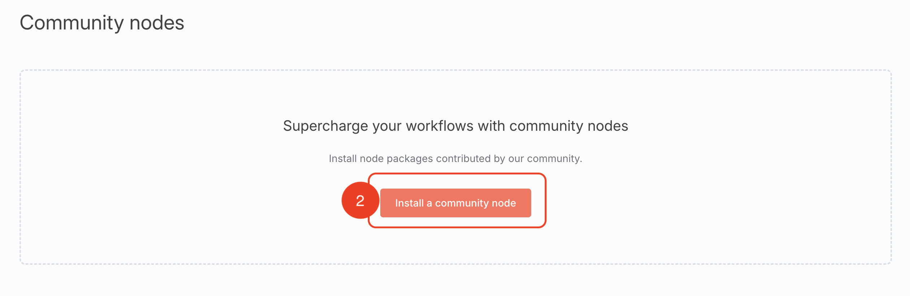
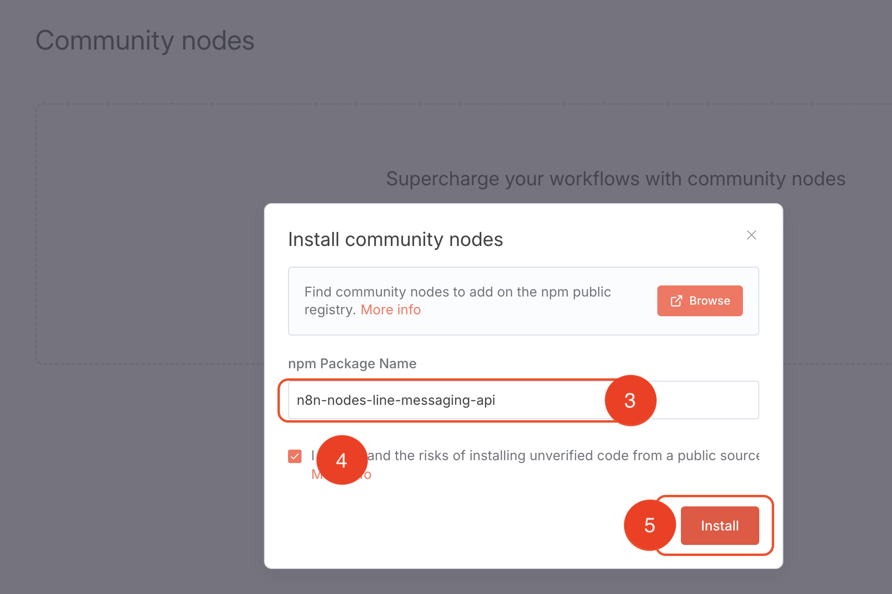

# n8n-nodes-linewebhook

This is a community node for [n8n](https://n8n.io/) that allows you to interact with the **LINE Messaging API**. It lets you create a LINE chatbot with n8n, often without any coding required.


---

**Documentation Versions**
- [English (This document)](#)
- [ภาษาไทย (Thai Version)](./documentation/README.th.md)

---

## Table of Contents

- [Installation](#installation)
- [Nodes and Operations](#nodes-and-operations)
- [Credentials](#credentials)
- [Example Workflow](#example-workflow)
- [Running Locally](#running-locally)

## Installation

### Community Nodes (Recommended)

1.  Go to **Settings > Community Nodes**.
2.  Select **Install**.
3.  Enter `n8n-nodes-line-messaging-api` in the **Enter npm package name** field.
<pre> n8n-nodes-line-messaging-api</pre>
4.  Agree to the risks of using community nodes by selecting **I understand the risks of installing unverified code from a public source**.
5.  Select **Install**




After installing, the node will appear in the Nodes panel and can be used like any other node.

!Community node installation

### Manual Installation

To install this node manually, install the package in your n8n root directory:

```bash
npm install n8n-nodes-linewebhook
```

For Docker-based deployments, add the following line to your n8n Dockerfile before the font installation command:


## Nodes and Operations

This package includes two main nodes:

### 1. Line Webhook (Trigger Node)

This trigger node starts your workflow when your bot receives an event from the LINE Platform.

!Line Webhook Node
!Line Webhook Settings

**Supported Event Types:**
*   `message` (with subtypes: `text`, `image`, `video`, `audio`, `location`, `sticker`)
*   `postback`
*   `join` / `leave`
*   `memberJoined` / `memberLeft`

### 2. Line (Regular Node)

This node performs actions using the LINE Messaging API.

#### Operation: Send Message

Sends a message. You can specify a `replyToken` to reply to an event from the webhook trigger, or a `targetRecipient` (like a User ID or Group ID) to push a message.

You can compose various message types, including:
- Text
- Image
- Video
- Audio
- Location
- Sticker
- Flex Message (using the JSON editor)

#### Operation: Get Message Content

When a webhook event contains a multimedia message (like an image or video), it only includes a `messageId`. Use this operation with the `messageId` to retrieve the actual file content. This is useful for saving user-submitted images to a service like AWS S3 or processing audio files.

See the official API documentation for more details.

#### Operation: Get User Profile

Retrieves a user's profile information (display name, picture URL, status message) using their User ID.

See the official API documentation for more details.

#### Operation: Get Group Chat Summary

Retrieves the summary of a group chat (group name and picture URL) using its Group ID.

See the official API documentation for more details.

## Credentials

You'll need credentials from the LINE Developer Console for your Messaging API channel.

### Webhook Credentials

Used by the **Line Webhook** trigger to verify that incoming requests are from LINE.

1.  In your LINE Developer Console, navigate to your channel's **Messaging API** settings.
2.  Copy the **Channel secret**.
3.  In the n8n Line Webhook node, create a new credential and paste the Channel Secret into the corresponding field.
4.  Copy the webhook URL from the n8n node and paste it into the **Webhook URL** field in your LINE channel settings.

!Set up channel secret

### Messaging API Credentials

Used by the **Line** node to make authenticated API calls (e.g., sending messages).

1.  In your LINE Developer Console, go to the **Messaging API** settings page.
2.  Find and copy the **Channel access token** (you may need to issue one if it doesn't exist).
3.  In the n8n Line node, create a new credential and paste this token into the **Channel Access Token** field.

!Credential example for Line Messaging API node

## Example Workflow

A common use case is to receive a message and send an immediate reply.

1.  Add a **Line Webhook** trigger node to your canvas. Configure its credentials and copy the webhook URL to your LINE channel.
2.  Add a **Line** node.
3.  Connect the output of the trigger to the input of the Line node.
4.  In the Line node, set the operation to **Send Message**.
5.  For the `Reply Token` parameter, use an expression to get the token from the trigger node: `{{ $json.events[0].replyToken }}`.
6.  Compose your reply message in the `Messages` parameter.

!Connect message node to api node
!Set up the api node to send message

## Running Locally

When running n8n on your local machine, the webhook URL (e.g., `http://localhost:5678`) is not accessible from the internet. To receive webhooks from LINE, you need a tunneling service to expose your local n8n instance to the web.

Popular options include:
- ngrok
- Cloudflare Zero Trust Tunnels